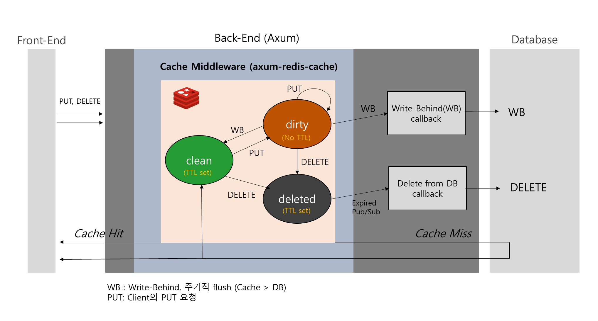

# axum-redis-cache

`axum-redis-cache` is a Redis caching middleware and background worker for [Axum](https://github.com/tokio-rs/axum).

[](https://github.com/lyh4215/axum-redis-cache/actions/workflows/ci.yml)


It enables **easily adding CRUD Redis caching** to your Axum applications with **write-behind policy support**.


## Key Features
You should inject your own logic to read, write, or delete data from your database.
- Simple CRUD Redis caching integration with Axum.
- **Write-behind cache**:
  - `GET`: Fetch from cache if available.
  - `PUT`: Check the dirty list first, then the clean list. Call your `put_to_cache`.
  - `DELETE`: Tag the cache key with `delete` and set an expiration.


### Background Workers

- **Write-behind worker**: Periodically flushes cached data to your database. Call your `put_function`.
- **Delete-event listener**: Listens for Redis key expiration events to trigger database deletion for stale data. Call your `delete_function`.

### Graceful Shutdown
- `shutdown` in `struct CacheManager` implemented graceful shutdown.

## Installation

Add to your `Cargo.toml`:

```toml
[dependencies]
axum-redis-cache = { git = "https://github.com/lyh4215/axum-redis-cache.git", branch = "main" }
```

## example
https://github.com/lyh4215/neural-notes-axum

## Contributing
Contributions are welcome and appreciated!